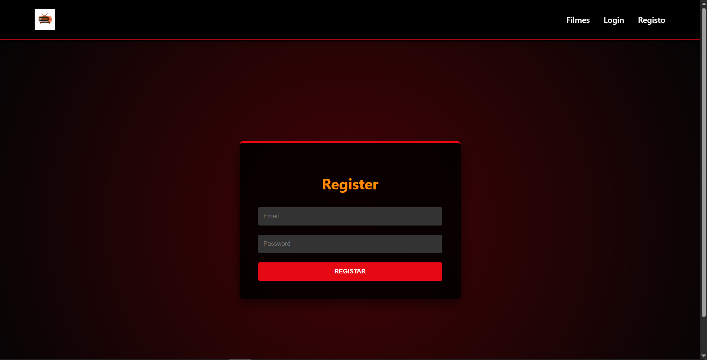
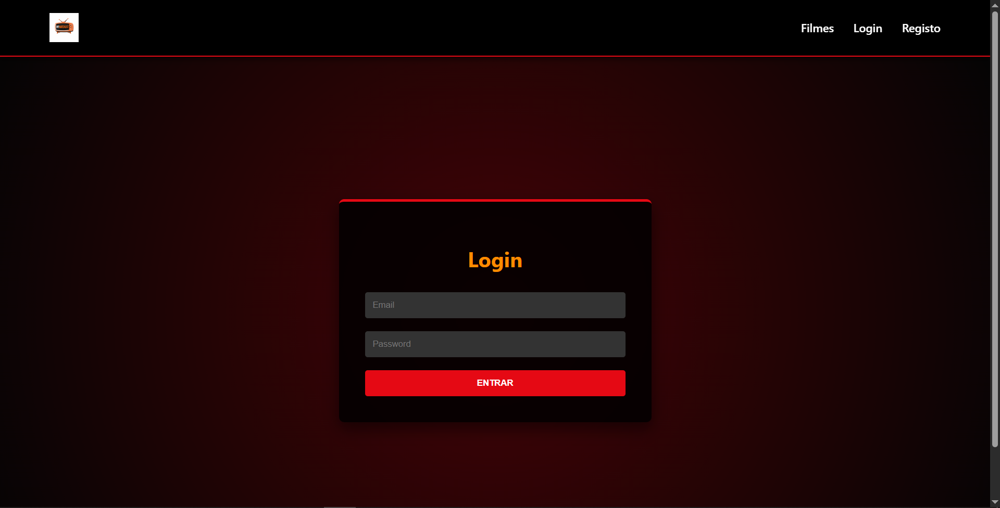
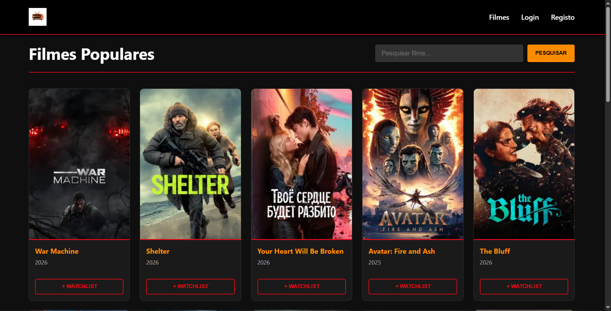
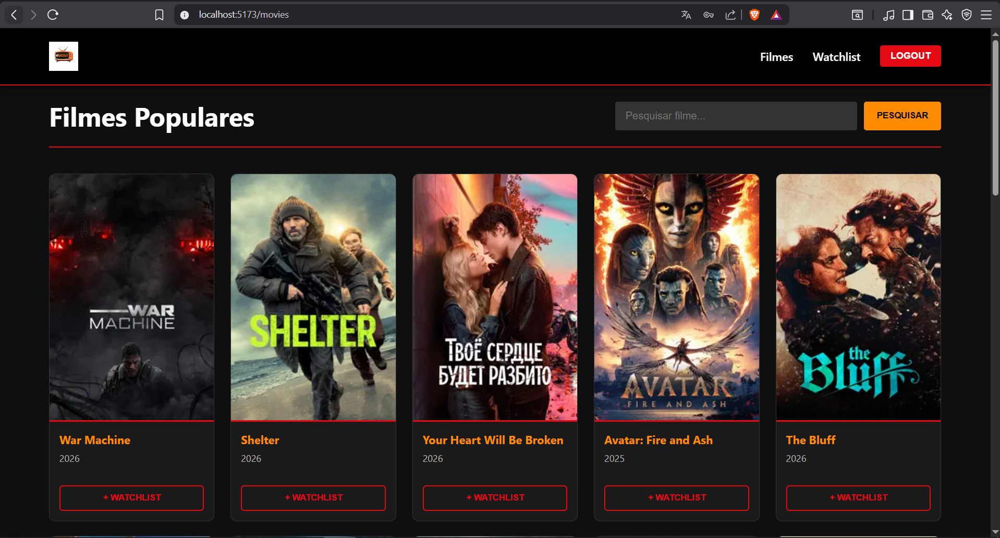
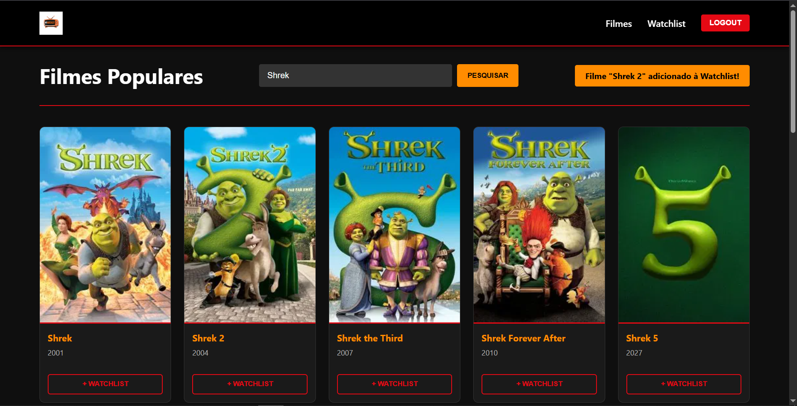
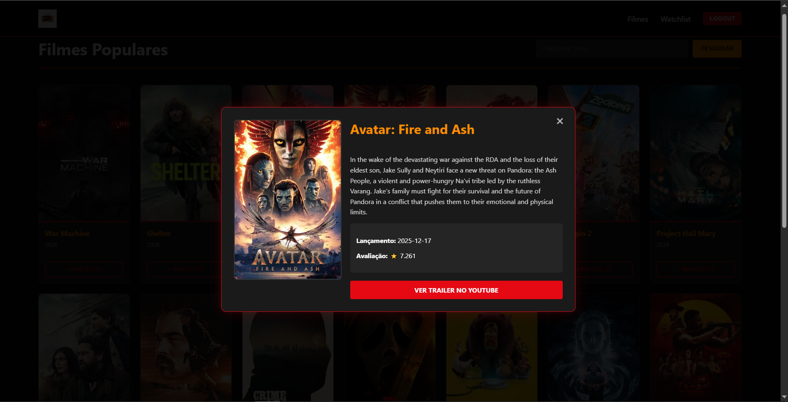
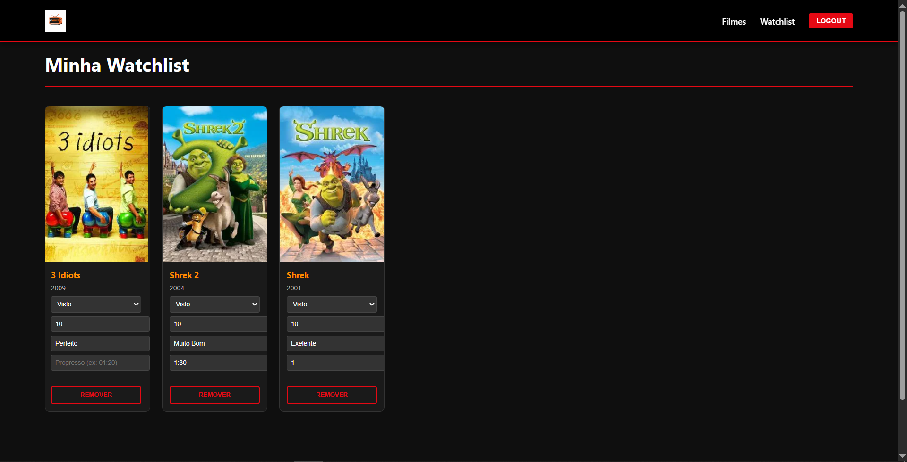

# 🎬 MyWatchlist

Aplicação web fullstack para explorar filmes e gerir uma lista pessoal (watchlist).

---

## 📖 Descrição

O **MyWatchlist** permite ao utilizador:

- 🔍 Pesquisar filmes (via TMDB API)
- 🎥 Ver detalhes completos (com popup)
- ➕ Adicionar filmes à watchlist
- ✏️ Atualizar estado, rating, notas e progresso
- ❌ Remover filmes
- 🔐 Registar e autenticar utilizadores

---

## 🚀 Tecnologias Utilizadas

### 🔧 Backend
- Node.js
- Express
- Prisma ORM
- PostgreSQL (NeonDB)
- JWT (autenticação)
- Bcryptjs

### 🌐 Frontend
- React (Vite)
- Axios
- CSS

### 🎬 API Externa
- TMDB API

---

## 📁 Estrutura do Projeto

```
MYWATCHLIST/
│
├── backend/
│   ├── prisma/
│   │   ├── migrations/
│   │   └── schema.prisma
│   ├── src/
│   │   ├── config/
│   │   ├── controllers/
│   │   ├── generated/
│   │   ├── middleware/
│   │   ├── routes/
│   │   ├── utils/
│   │   └── server.js
│   ├── .env
│   └── prisma.config.ts
│
├── frontend/
│   ├── Images/
│   ├── public/
│   ├── src/
│   │   ├── api/
│   │   ├── components/
│   │   ├── context/
│   │   ├── css/
│   │   ├── pages/
│   │   ├── App.jsx
│   │   ├── main.jsx
│   │   └── index.css
│
└── README.md
```

---

## 🔧 Backend

Responsável por:

- Autenticação com JWT
- Gestão da Watchlist
- Integração com TMDB

### 🔗 Endpoints

#### Auth
- POST /auth/register → Registar utilizador
- POST /auth/login → Login
- POST /auth/logout → Logout

#### Movies
- GET /movies/popular → Filmes populares
- GET /movies/search?q= → Pesquisa
- GET /movies/:id → Detalhes

#### Watchlist
- GET /watchlist → Lista do utilizador
- POST /watchlist → Adicionar filme
- PUT /watchlist/:movieId → Atualizar
- DELETE /watchlist/:movieId → Remover

---

## 🌐 Frontend

Interface desenvolvida em React que permite:

- Navegação entre páginas
- Gestão de autenticação
- Consumo da API
- Visualização de filmes com imagens e detalhes

---

## 🖼️ Imagens da Aplicação

### 📝 Registo


### 🔑 Login


### 🎬 Filmes (Não Logado)


### 🎬 Filmes (Logado)


### ➕ Adicionar Filme


### 📄 Popup Detalhes


### ⭐ Watchlist


---

## ▶️ Como Executar

### 1️⃣ Clonar repositório

```
git clone https://github.com/FranciscoG08/MyWatchlist.git
cd MyWatchlist
```

---

### 💻 Backend

```
cd backend
npm install
npx prisma generate
npm run dev
```

Servidor disponível em:
http://localhost:5001

---

### 🌐 Frontend

```
cd frontend
npm install
npm run dev
```

Aplicação disponível em:
http://localhost:5173

---

## ⚠️ Notas

- O projeto usa JWT para autenticação
- Dados dos filmes vêm da API TMDB
- A watchlist é guardada na base de dados PostgreSQL

---

## ⚠️ Notas2

- Projeto feito com auxílio de IA

---

## 👨‍💻 Autor

**Francisco Guedes**

GitHub: https://github.com/FranciscoG08
